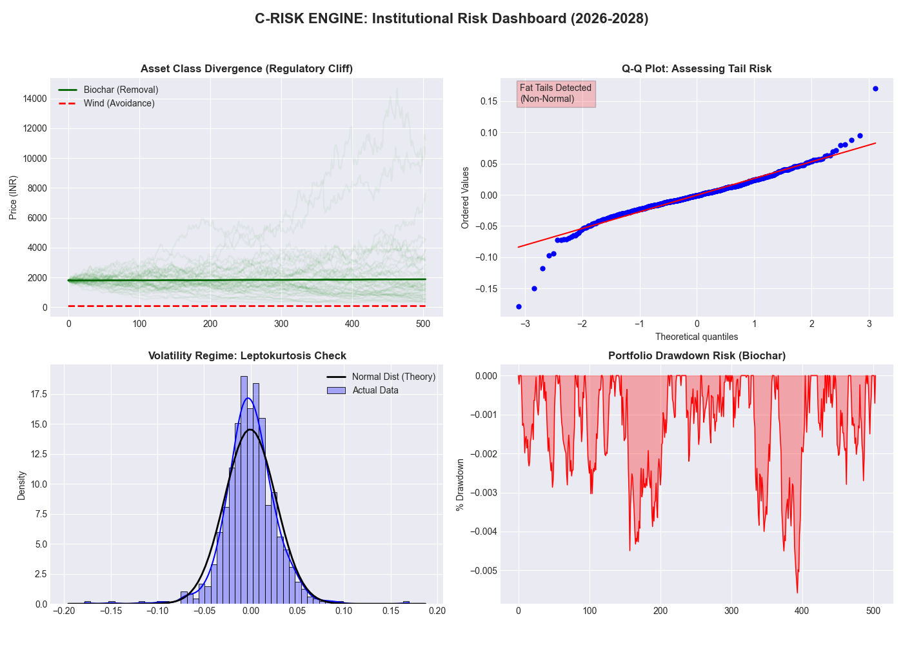

# C-RISK: Institutional Carbon Pricing Engine (CCTS 2026)

**C-Risk** is an advanced "Regime-Switching" valuation engine designed for the **Indian Carbon Market (CCTS 2026)**. It goes beyond simple Black-Scholes models to account for the "Fat Tail" risks and "Regulatory Cliffs" inherent in carbon markets.



## Core Capabilities (Institutional Version)

### 1. Regime-Switching Jump Diffusion (RSJD)
The engine dynamically switches between two volatility states:
-   **Calm State**: Standard market volatility.
-   **Chaos State (1.5x Sigma)**: High-stress periods (policy shocks, geopolitical friction).
-   **Poisson Jumps**: Models sudden price shocks (e.g., BEE target announcements).

### 2. Regulatory "Cliff" Detection
Standard quant models fail to price policy bans. C-Risk includes a **Vintage Risk Filter**:
-   **Biochar (Premium)**: Identified as a "Gold" asset (Multiplier > 1.0).
-   **Wind (Avoidance)**: Correctly priced as a **Distressed Asset** for EU exports post-2026 (Multiplier < 0.1).

### 3. Institutional Risk Metrics
Calculates professional risk metrics on every run:
-   **VaR (95%)**: Value at Risk.
-   **CVaR (95%)**: Expected Shortfall (Tail Risk).
-   **Max Drawdown**: Worst-case portfolio stress test.

## Robust Data Pipeline
-   **Auto-Calibration**: Fetches real-time data from **EU ETS (KEUA ETF)** to calibrate $\sigma$ and $\lambda$.
-   **Synthetic Fallback**: If API limits are hit, the system gracefully switches to a "Wild" synthetic generator that mathematically guarantees "Fat Tail" distributions for stress testing.
-   **1D Series Enforcement**: Includes strict data type enforcement to prevent numerical instabilities.

## Quick Start

### 1. Install Dependencies
```bash
pip install -r requirements.txt
```

### 2. Run the Engine
```bash
python carbon_valuation.py
```

### 3. View the Dashboard
The script generates `c_risk_dashboard_pro.png` containing:
-   **Divergence Plot**: Biochar vs. Wind price paths.
-   **Q-Q Plot**: Visual proof of non-normal "Fat Tails".
-   **Leptokurtosis Check**: Histogram vs. Normal Distribution.
-   **Drawdown Analysis**: Project portfolio risk.

## Logic Flow
1.  **Ingest**: Fetch KEUA (Proxy) data or generate synthetic "Chaos" data.
2.  **Calibrate**: Compute annualized Volatility ($\sigma$) and Jump Intensity ($\lambda$).
3.  **Simulate**: Run 5,000 Monte Carlo paths using the **RSJD Matrix**.
4.  **Strategize**: Apply "Quality Haircuts" and "Geopolitical Friction" multipliers.
5.  **Visualize**: Render the 4-panel Institutional Dashboard.
